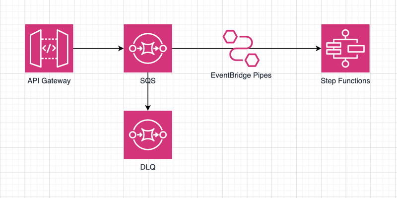

# CDK Webhook
CDK Serverless Webhook project which uses the AWS services:
* SQS
* API Gateway
* EventBridge Pipes
* Step Functions

[My Blog were I describe how I did it and why I chose this architecture](https://dev.to/katherine_m/creating-resilient-webhooks-on-aws-cdk-10pd)

